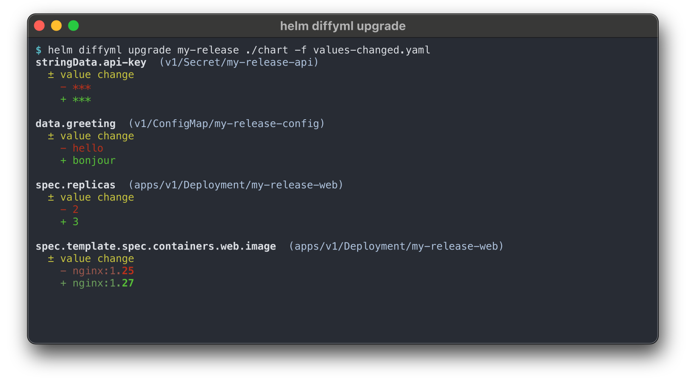

# helm-diffyml

A Helm plugin that wraps [`diffyml`](https://github.com/szhekpisov/diffyml) to
produce **structural** diffs of rendered Kubernetes manifests — what's actually
going to change in your cluster, not a noisy line-by-line text diff.



```
helm diffyml upgrade  my-release ./chart -f values.yaml
helm diffyml release  my-release my-release-canary
helm diffyml revision my-release 1 2
helm diffyml rollback my-release           # preview rollback to previous revision
helm diffyml version
```

## Compared to helm-diff

[`helm-diff`](https://github.com/databus23/helm-diff) is the long-established
incumbent. Its default output is a **textual** unified diff of the rendered
YAML; passing `--output dyff` switches it to a structural diff via
[dyff](https://github.com/homeport/dyff). helm-diffyml is structural by
design (uses [`diffyml`](https://github.com/szhekpisov/diffyml) as the
engine), so the apples-to-apples comparison is against `helm diff --output
dyff`, not the textual default.

What helm-diffyml adds over `helm diff --output dyff`:

| Feature | helm-diffyml | `helm diff --output dyff` |
|---|---|---|
| `--neat` — automatic stripping of Helm/ArgoCD/Flux-injected and `kubectl.kubernetes.io/last-applied-configuration` noise | ✓ profile-based, on by default | ✗ (helm-diff offers per-path `--suppress`) |
| `--mask-secrets` — field-level redaction of `data`/`stringData` on `Kind: Secret` | ✓ on by default (mask placeholder is configurable) | ✗ (helm-diff has `--show-secrets`, an all-or-nothing toggle for the whole resource) |
| Color highlighting *inside* string values (e.g. `nginx:1.25 → nginx:1.27` highlights just the version) | ✓ | ✗ |
| CI-platform output formats (`-o github`, `-o gitlab`, `-o gitea`) and `-o json-patch` (RFC 6902) | ✓ | ✗ (only its own structured / json / template) |
| Single self-contained binary (diff engine embedded as a Go library) | ✓ | helm-diff also single-binary, but its dyff support is built in via the dyff Go library too |

What helm-diff still has more of:

- Battle-testing and ecosystem reach (8+ years, ArgoCD/FluxCD/helmfile integration, Krew listing, Windows builds).
- A wider native flag set (`--suppress`, `HELM_DIFF_TPL` Go templates, `--strip-trailing-cr`, `--disable-*-validation`, etc.).
- `revision` subcommand support for some additional history paths (e.g.
  including hooks via release storage, which neither tool currently does).

If you're already happy with `helm diff` and want structural output, just
pass `--output dyff` — that's a smaller change than swapping plugins. If
you specifically want the noise filtering, secret masking, and the broader
output catalog above, that's the case for helm-diffyml.

## Install

```sh
helm plugin install https://github.com/szhekpisov/helm-diffyml
```

This downloads a single `helm-diffyml` binary into the plugin directory and
verifies its SHA-256 against the release's `checksums.txt`. Linux and macOS,
amd64 and arm64 are supported. The diffyml diff engine is embedded in the
binary, so there is no separate `diffyml` install step.

To pin a specific plugin version:

```sh
helm plugin install https://github.com/szhekpisov/helm-diffyml --version 0.1.0
```

## Subcommands

### `helm diffyml upgrade RELEASE CHART [flags] [-- diffyml flags]`

Compares the **currently installed manifest** of `RELEASE`
(`helm get manifest`) against a **freshly rendered** chart
(`helm template RELEASE CHART ...`). This is the headline use case: "what
will my next `helm upgrade` change?"

If `RELEASE` doesn't exist yet, the "from" side is treated as empty so the
output is a pure addition (initial-install preview).

### `helm diffyml release REL_A REL_B [flags] [-- diffyml flags]`

Compares the stored manifests of two live releases. Useful for blue/green or
canary comparisons.

### `helm diffyml revision RELEASE REV_A REV_B [flags] [-- diffyml flags]`

Compares two specific revisions of a single release
(`helm get manifest RELEASE --revision N`). Use `helm history RELEASE` to find
the revision numbers.

### `helm diffyml rollback RELEASE [REVISION] [flags] [-- diffyml flags]`

Previews a `helm rollback`. Diffs the current release manifest against the
manifest of `REVISION`. If `REVISION` is omitted, the immediately previous
revision is selected (matches the default of `helm rollback`).

### `helm diffyml version`

Prints the plugin version (with build commit and date) and the embedded
diffyml module version.

## Flags

Three classes of arguments:

**Helm-passthrough** (forwarded to inner `helm template` / `helm upgrade --dry-run` /
`helm get manifest`):

```
-f, --values FILE        --set NAME=VALUE       --set-string NAME=VALUE
--set-file NAME=PATH     -n, --namespace NAME   --kube-version SEMVER
--api-versions LIST      --version VERSION      --devel
--repo URL               --username U  --password P
--ca-file F  --cert-file F  --key-file F  --insecure-skip-tls-verify
--post-renderer PATH
```

The full list applies to `helm diffyml upgrade`. The `release`, `revision`,
and `rollback` subcommands only need `-n, --namespace`.

**Plugin-meta** (these toggle defaults, they're owned by the plugin):

| Flag | Effect |
|---|---|
| `--no-neat` | Drop the `--neat` default (keeps Helm/ArgoCD/Flux noise) |
| `--no-mask-secrets` | Drop the `--mask-secrets` default |
| `--no-omit-header` | Drop the `--omit-header` default |
| `-o, --output FORMAT` | `detailed` (default) `\| compact \| brief \| github \| gitlab \| gitea \| json \| json-patch` |
| `--exit-code` | Exit 1 on differences (mirrors `helm-diff --detailed-exitcode`) |
| `--dry-run` | Print the constructed `diffyml` command and exit 0 |
| `--use-upgrade-dry-run` *(`upgrade` only)* | Source B uses `helm upgrade --dry-run --output yaml` instead of `helm template` (high-fidelity preview that honours `lookup`, post-renderers, live cluster state). Falls back to `helm install --dry-run` when the release does not yet exist. Toggle the default with `HELM_DIFFYML_USE_UPGRADE_DRY_RUN=true`; `--no-use-upgrade-dry-run` overrides the env var on a single call. |
| `--three-way-merge` *(`upgrade` only)* | Diff against **live cluster state** instead of the stored manifest, computing a strategic-merge three-way patch per resource (JSON merge fallback for CRDs). Catches out-of-band drift like `kubectl edit`, controller-applied mutations, and admission-webhook-injected fields that `helm get manifest` doesn't see. Resources tracked by the release but absent from the new render show up as deletions. Composes with `--use-upgrade-dry-run` for the target side. Toggle with `HELM_DIFFYML_THREE_WAY_MERGE=true`; `--no-three-way-merge` overrides per call. |
| `--reuse-values` *(`upgrade` only)* | Reuse the existing release's stored values, merging new `-f`/`--set` on top (CLI wins on conflict). Mirrors `helm upgrade --reuse-values`. |
| `--reset-values` *(`upgrade` only)* | Ignore the existing release's values; render with chart defaults + CLI overrides. Mirrors `helm upgrade --reset-values`. If both `--reuse-values` and `--reset-values` are passed, `--reset-values` wins (helm-diff parity). |
| `--no-hooks` *(`upgrade` only)* | Strip helm hook resources (pre/post-install/upgrade/etc.) from the rendered diff. By default hooks are included (matching helm-diff). |
| `--include-tests` *(`upgrade` only)* | Also include test-event hooks (`helm.sh/hook=test`) in the diff. Off by default; ignored when `--no-hooks` is set. |

> The plugin owns `--no-*` flags. Do not pass `--no-neat` through the `--` escape
> hatch — `diffyml` itself has no `--no-neat`, only `--neat`.

**Diffyml-passthrough**: anything after a literal `--` is forwarded to
`diffyml` verbatim. Use this for `--ignore-api-version`, `--filter`,
`--exclude-regexp`, `--detect-renames`, etc.:

```sh
helm diffyml upgrade my-rel ./chart -- --ignore-api-version --filter 'Deployment/*'
```

## Defaults (Helm-tuned)

The plugin enables these `diffyml` flags unless you opt out:

- `--neat` — strips well-known noisy paths (Helm/ArgoCD/Flux annotations).
- `--mask-secrets` — masks `data`/`stringData` of `Kind: Secret` objects.
- `--omit-header` — no banner before the diff.
- `-o detailed` — multi-line YAML-style output, easy to read for upgrade previews.
  Switch to `-o compact` for a one-line-per-change overview.

It does **not** enable `--set-exit-code` by default — interactive Helm users
expect exit 0. Pass `--exit-code` (which maps to `diffyml --set-exit-code`) to
flip that.

## Exit codes

- `0` — no differences (or differences without `--exit-code`).
- `1` — differences found, with `--exit-code`.
- `255` — `diffyml` tool error (forwarded verbatim so CI can distinguish).

## Caveats

- **`helm get manifest` ≠ `helm template`.** `get manifest` returns what's in
  the release secret (post-render hooks applied, no `lookup` re-evaluation).
  `helm template` re-renders fresh. For the highest-fidelity preview, pass
  `--use-upgrade-dry-run` (or set `HELM_DIFFYML_USE_UPGRADE_DRY_RUN=true`) so
  source B comes from `helm upgrade --dry-run` instead, which honours `lookup`,
  post-renderers, and live cluster state.
- **Three-way merge for native Kubernetes types uses strategic-merge-patch**
  (so list-merge keys like `containers[name=X]` merge correctly), with
  fallback to JSON merge patch for CRDs and other types not registered in
  `k8s.io/kubectl/pkg/scheme`. The `overwrite=true` semantics match
  `helm upgrade`'s default reconcile behaviour: chart values override
  out-of-band drift.
- **Color in pipes.** `diffyml --color auto` correctly disables color when
  stdout isn't a TTY. For `| less -R`, pass `-- --color always`.

## Optional: cosign verification

Releases include cosign signatures for `checksums.txt` and SBOM files.
The install hook does not enforce cosign verification (it would require
`cosign` on every user's machine), but you can verify manually:

```sh
cosign verify-blob \
  --certificate-identity-regexp 'https://github.com/szhekpisov/helm-diffyml/' \
  --certificate-oidc-issuer 'https://token.actions.githubusercontent.com' \
  --bundle  helm-diffyml_<ver>_<os>_<arch>.tar.gz.sigstore.json \
  helm-diffyml_<ver>_<os>_<arch>.tar.gz
```

## Development

```sh
# Build the binary into ./bin/helm-diffyml
make build

# Install the local build into Helm's plugin directory (replaces any existing install)
make install

# Run vet + tests
make vet
make test

# Cluster smoke test (requires a working kubeconfig and the plugin installed)
sh test/cluster_smoke_test.sh

# Regenerate the README demo screenshot (requires termframe + rsvg-convert)
sh scripts/gen-screenshot.sh
```

See [CHANGELOG.md](CHANGELOG.md) for the version history and any breaking
changes between releases.

## License

MIT — see [LICENSE](LICENSE).
